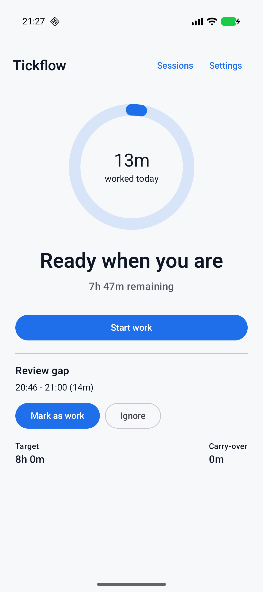

# Tickflow

Tickflow is a privacy-first Android workday assistant that tracks time from the signals you already have: your office Wi-Fi, your manual starts and stops, and the gaps you choose to correct.

It is built for people who want an accurate workday total without managing a timer all day. When you arrive at the office, Tickflow can start tracking from the configured Wi-Fi connection. When you leave, it stops. If you step out and return, Tickflow can surface the gap so you can mark it as work with one tap. Your carry-over balance and predicted remaining time adjust from the sessions stored on your device.

<p align="center">
  
</p>

## What It Does

- Tracks work automatically from a configured office Wi-Fi network.
- Supports manual start and stop for remote work, travel, meetings, and exceptions.
- Keeps work sessions locally with editable history.
- Carries overtime or undertime into future workdays.
- Predicts how much time remains in the current day.
- Reviews short away-and-return gaps so they can be marked as work or ignored.
- Exports sessions as CSV through Android's share sheet.
- Runs without accounts, cloud sync, analytics, advertising, or remote logging.

## Current State

Tickflow is an MVP Android app with a working Kotlin and Jetpack Compose implementation. The current build includes setup, home status, manual tracking, Wi-Fi presence tracking, correction review, session editing, settings, CSV export, foreground notification tracking, reboot recovery wiring, scheduled rollover work, Room persistence, DataStore settings, and focused unit coverage for the core time logic.

Runtime validation has been performed on a Pixel 10 running Android 16 for core manual tracking, notification stop, Wi-Fi disconnect/reconnect, active session recovery, and gap review behavior. Remaining work is focused on deeper instrumentation coverage, reboot and long-running lifecycle validation, accessibility polish, and store release preparation.

## Architecture

Tickflow is a single-module Android application organized around clear platform, domain, data, and UI boundaries.

| Area | Stack |
| --- | --- |
| UI | Jetpack Compose, Material 3, Navigation Compose |
| State | ViewModels, Kotlin coroutines, Flow |
| Persistence | Room for sessions and balances, DataStore for settings |
| Background work | Foreground service, WorkManager, boot recovery receiver |
| Dependency injection | Hilt |
| Connectivity | Android network callbacks and Wi-Fi SSID/BSSID checks |
| Testing | JUnit, Robolectric, Room testing, coroutine testing, Turbine, AndroidX test |

Core product rules live in domain use cases and services, including day slicing, carry-over calculation, leave prediction, tracking state reduction, presence decisions, and correction suggestions. Android-specific behavior is kept in platform adapters for notifications, Wi-Fi presence, services, receivers, and workers.

## Privacy Model

Tickflow is local-first by design.

- Work sessions, schedules, Wi-Fi identifiers, preferences, and correction decisions stay on the device.
- No account is required for core functionality.
- No analytics, crash reporting, telemetry, advertising SDKs, or cloud sync are included in the MVP.
- Location-related permission is used only because Android requires it to read Wi-Fi SSID/BSSID information; Tickflow does not use GPS tracking.
- Local data deletion is available from Settings.

See [docs/privacy.md](docs/privacy.md) for the detailed privacy notes.

## Build

The project targets Java 17 bytecode and Android SDK 36.

```bash
JAVA_HOME=$PWD/.jdk/jdk17 ./gradlew testDebugUnitTest
JAVA_HOME=$PWD/.jdk/jdk17 ./gradlew assembleDebug
JAVA_HOME=$PWD/.jdk/jdk17 ./gradlew assembleRelease
```

On a normal development machine, use an installed JDK 17 and Android SDK. In this workspace, a local ignored JDK and Android SDK are used because the host JDK is newer than the current Android Gradle Plugin toolchain path supports.

Build outputs:

- Debug APK: `app/build/outputs/apk/debug/app-debug.apk`
- Unsigned release APK: `app/build/outputs/apk/release/app-release-unsigned.apk`
- Signed release APK, when signing environment variables are present: `app/build/outputs/apk/release/app-release.apk`

Release signing is optional and environment-variable driven. See [docs/release.md](docs/release.md).

## Documentation

- [IDEA.md](IDEA.md) captures the product concept.
- [docs/status.md](docs/status.md) tracks implementation status and remaining MVP work.
- [docs/manual-qa.md](docs/manual-qa.md) records device validation.
- [docs/constraints.md](docs/constraints.md) defines engineering boundaries.
- [docs/plan.md](docs/plan.md) outlines the delivery plan.
- [AGENT.md](AGENT.md) preserves the previous repository README content.

## License

Tickflow is licensed under the terms in [LICENSE](LICENSE).
